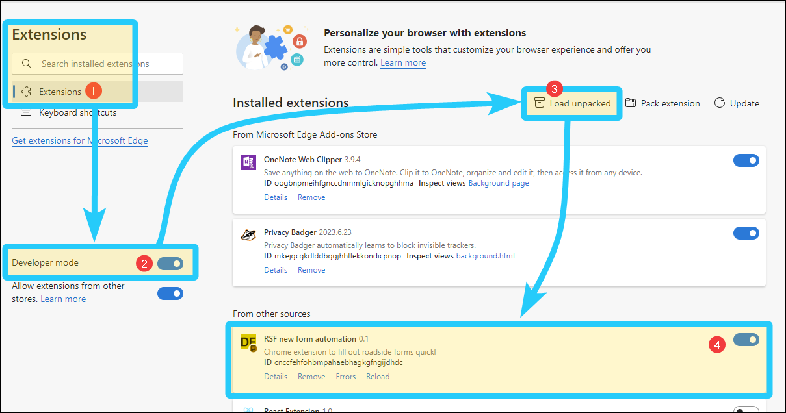
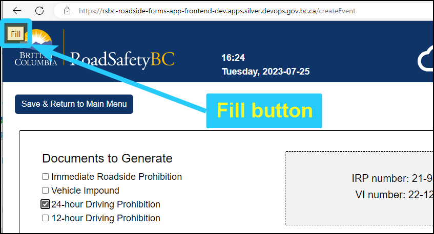
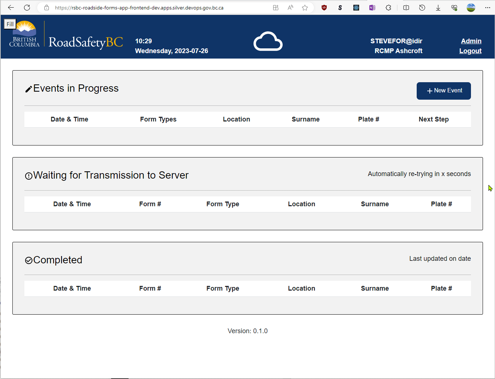

# Roadside forms automation browser extension
*A minimal browser extension to make filling out roadside digital forms easier.*

This README and the source code is on GitHub: https://github.com/bcgov/rsbc-digital-forms/tree/qa/chromium-test-extension/qa/df-test-extension

## Description

When you install this extension, a small "Fill" button will be added to the top-left corner of Digital Forms pages in the DEV, TEST, and PROD environments. When you click "Fill", the form is filled using random valid values. It may take a second or two for the fields to fill. Once filled, make adjustments to selections and values to suit your needs. Different values are used each time the Fill button runs.

This speeds working with the forms, allowing you to focus on the task at hand instead of having to think about which fields you need and the values to enter. This gives you back time and reduces decision fatigue while working with the forms.

## Installation

The extension works in Microsoft Edge and Google Chrome. There is currently no version for Firefox as Firefox is unsupported by Digital Forms.

### Chrome Web Store (easiest)

This extension is available from the Chrome Web Store, but it's unlisted and should not show up in searches. Open the following link to see the extension in the web store and install the extension in your browser:

[Chrome Web Store Link](https://chrome.google.com/webstore/devconsole/741cffb5-4b89-410d-b746-281caac5968e/fjmiihmammcnhbkijhdnbjlklejdcgee/edit/listing)

For details on the Chrome Web Store listing, and how to publish a new version of the extension, see [STORE.md](STORE.md).

### Side-load in developer mode

Go to **Settings** > **Extensions** and enable developer mode. After enabling developer mode, you should see the option **Load Unpacked** appear. Click it and select the folder where this file is located. The extension should appear in your extensions.

The extension activates automatically when you go to the DEV, TEST, or local development environments. When the extension is active, its icon changes from grey to gold, and a yellow Fill button overlay will appear.

Installation steps:
 1. Go to Extensions.
 2. Enable developer mode.
 3. Select "Load Unpacked" on the extensions page.
 4. Enable the extension, if it was not enabled automatically.
 5. Go to the DEV, TEST, or local environments and you should see a yellow "Fill" button in the top-left corner of the page. If you do not see the button, refresh the page.

## Usage

When in the DEV, TEST, or local environments, create a new event and select the forms you want (for example: 24-hour and VI). Click the "Fill" button in the top-left corner of the page and after a short delay, the fields will fill with random selections and values. Click the Fill button again to refresh the random data.

Example of clicking the "Fill" button:

### Hotkeys

Instead of pressing the Fill button, you can also use hotkeys:

- Alt+I: inject random values on the current page.
- Alt+H: Hide the Fill button. Useful when taking screenshots or printing.

## Making changes to this extension

If you want to make changes to this project, see [DEVELOPER.md](DEVELOPER.md) for details.

## Future improvements

As the DF project will likely migrate from React to AOT's Forms Flow product, there are currently no improvements to this extension planned.

However, future versions of this extension could have the following features:
 
- When you click the extension icon in the toolbar, a menu could allow the user to choose different options.
- Allow the user to define their own test records (always use one particular field and value).
- Allow the user to select from pre-configured driver licence or vehicle profiles. This could be useful when testing with ICBC.
- Add a hotkey to clear all the fields on the form.
- Add a hotkey menu to guide users in hotkey use.
- Port the extension to other browsers, like Edge or Firefox.
