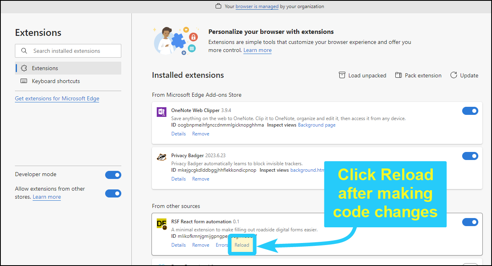

## Developer notes

This extension works by injecting a JavaScript "Fill" button onto pages that load from the DEV, TEST, and local environments. The Fill button adds a JavaScript function to the DOM that will go through every section on the page and randomly pick selections or and assign values.

## Making changes to this extension
If you want to modify this project, here is a description of what each file does:

- **icons/***: folder for icon images shown in the extension bar.
- **chance.min.js**: copy of the open-source chance.js library, for generating field values.
- **content.js**: the primary script, which gets called when the Fill button is pressed. Add or remove fields to be filled here.
- **helper-functions.js**: helper functions called from content.js. Contains data tables and functions to update elements on the page.
- **tables.js**: data used from content.js (e.g. a table of towns and cities in BC).
- **manifest.json**: the file that the browser uses to get information about this extension. Configure the URLs to activate the extension here.
- **DEVELOPER.MD**: this page, with tips on how to update this extension.
- **README.md**: instructions for installing and using this extension.


### Firefox support
To get the extension to work in Firefox, change the manifest to v2. If you do this, the browser will no longer work in Chromium-based browser, so be careful. I have not built a version of the extension for Firefox because police do not use Firefox.


### Custom React control fields
The forms contain a custom React drop-down selection fields. These were very difficult to automate working as their behaviour is non-standard. I was able to get them to update by creating a watcher to wait until the fields are updated, then simulate a click on them. That's why there is a delay for their update after clicking the Fill button.  Here is a list of the custom form fields:

- Vehicle year
- Vehicle make/model
- Vehicle style
- Vehicle colour
- ILO

The code to handle these custom controls is in helper-functions.js and the function name is SetCustomSelect(id, value). If the custom controls fail to update at some point, this is where you need to look.


## Workflow description
The extension adds a button to the page. The code for the button is in content.js and the function is called AddButton. The button has a listener that waits for a click event. When you click the button, the event listener calls functions to fill out each section on the form. For example, to fill out the "Driver's Information" section, it calls the function `FillDriverSection()`. There is a function for each section.

For each section function, there are sub-functions fill out each field in the section. For example, in the `FillDriverSection()` function the following fields are filled:

```JavaScript
function FillDriverSection() {
    SetField('drivers_licence_no', GenerateDL());
    SetField('driver_last_name', chance.last());
    SetField('driver_given_name', GenerateGivenNames());
    SetField('driver_dob', GenerateDateOfBirth());
    SetField('driver_address', GenerateStreetAddress());
    SetField('driver_phone', GeneratePhoneNumber());
    SetField('driver_city', GenerateCity())
    SetField('driver_postal', GeneratePostalCode());
    SetField('gender', RandomGender());
    SetField('driver_licence_expiry', GenerateDLExpiryDate());
    SetField('driver_licence_class', GenerateRandomDlClass());
}
```

In the function above, you can see the driver's licence number is filled first. It finds the field with the element id `drivers_licence_no` and simulates the entry of the value returned from the `GenerateDL()` function. The `SetField` and `GenerateDL` functions are in helper-functions.js.

This workflow is used for all the forms on the field. If an id for an element changes, you need to change the id for the appropriate section in content.js.

## Libraries

There is one library used by this extension: [Chance.js](https://chancejs.com/). Rather than hot-linking to the library, it is included as chance.min.js in this extension. This saves the developer's bandwidth and protects against a new release introducing incompatible changes that break this extension.


## After making changes
If you make a change to the code in this extension, you must reload the extension in your browser. This is done from the Extensions page. If developer mode is enabled, you should see a link to reload the extension. You must also reload the tab where the form is loaded, which will activate the new version of the extension.


