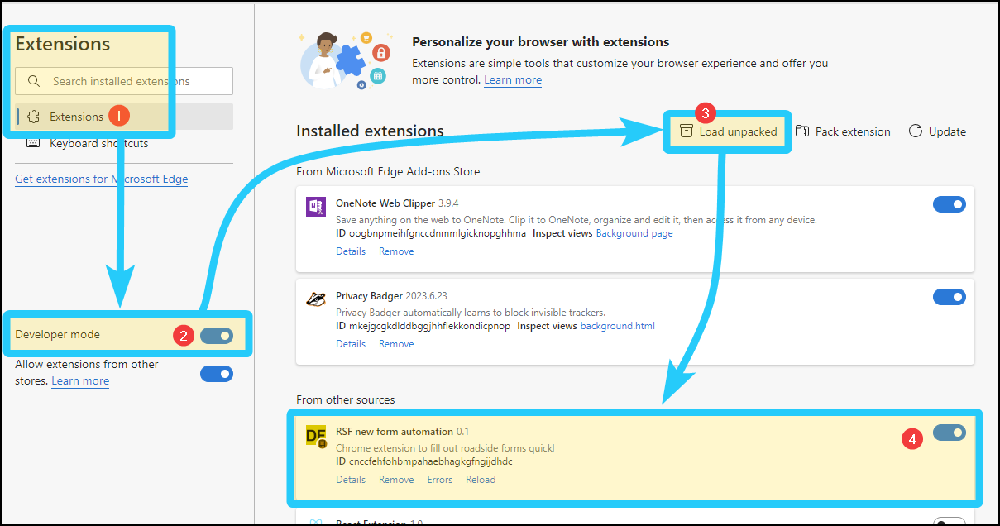
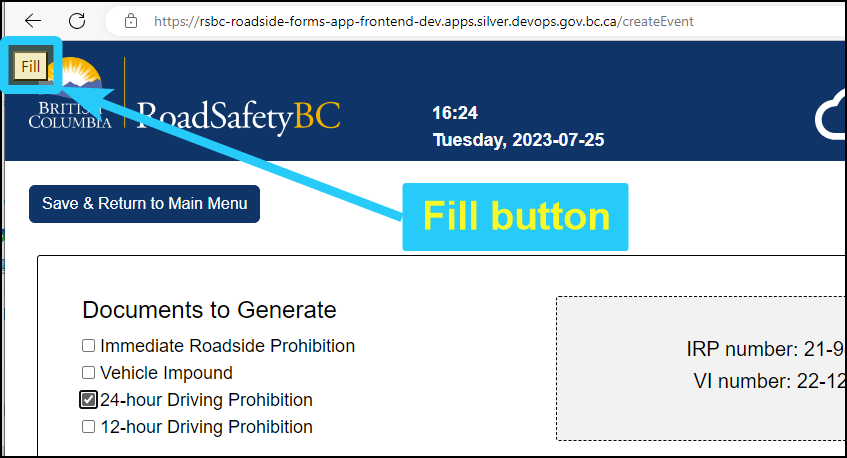
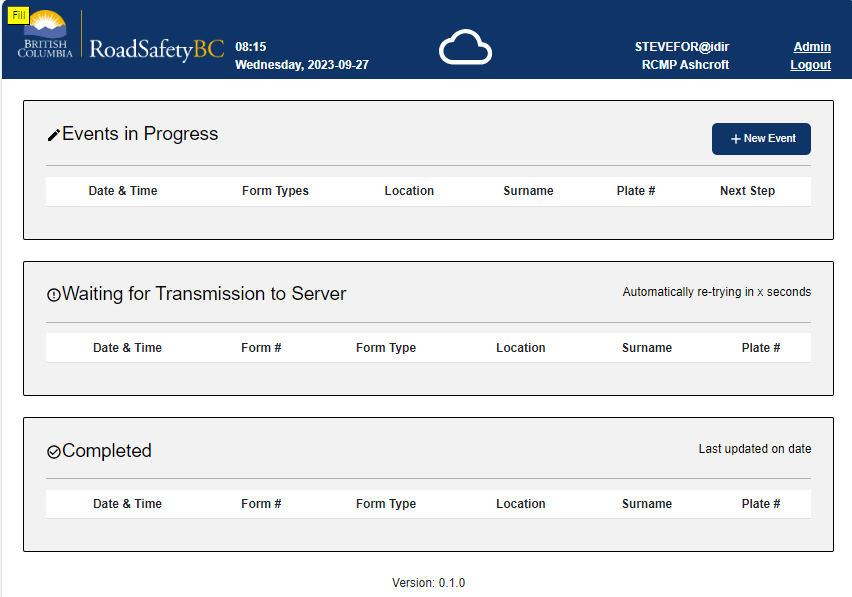

# Roadside forms automation browser extension
*A minimal browser extension to make filling out roadside digital forms easier.*

## Description
When you install this extension in your browser and go to the Digital Forms DEV or TEST environment, a "Fill" button will be added to the top-left corner of the page. Every field will be filled out randomly. Make adjustments to the form selections or values as needed. 

This greatly speeds up intuitive testing, allowing you to focus on the task at hand instead of having to think about which fields you need and which values to enter.

The extension works in Edge and Chrome, Windows or macOS.

## Installation
Go to **Settings** > **Extensions** and enable developer mode. After enabling developer mode, you should see the option **Load Unpacked** appear. Click it and select the folder where this file is located. The extension should appear in your extensions.

The extension activates automatically when you go to the DEV, TEST, or local development environments. When the extension is active, its icon changes from grey to gold, and a yellow Fill button overlay will appear.

Installation steps:
 1. Go to Extensions.
 2. Enable developer mode.
 3. Select "Load Unpacked" on the extensions page.
 4. Enable the extension, if it was not enabled automatically.
 5. Go to the DEV, TEST, or local environments and you should see a yellow "Fill" button in the top-left corner of the page. If you do not see the button, refresh the page.

## Usage

When in the DEV, TEST, or local environments, create a new event and select click the forms you want (for example: 24-hour and VI). Click "Fill" button in the top-left corner of the page and after a short delay the fields will fill random selections and values. Click the Fill button again to refresh the random data.

Example of clicking the "Fill" button:

## Making changes to this extension

If you want to modify this project, see [DEVELOPER.md](DEVELOPER.md) for tips.
